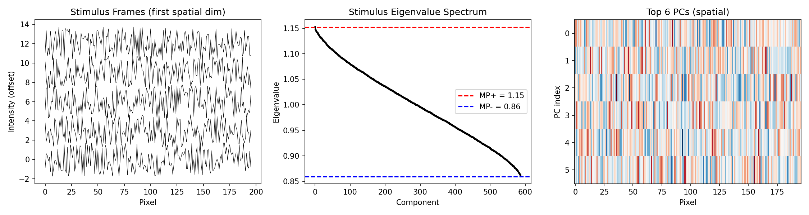
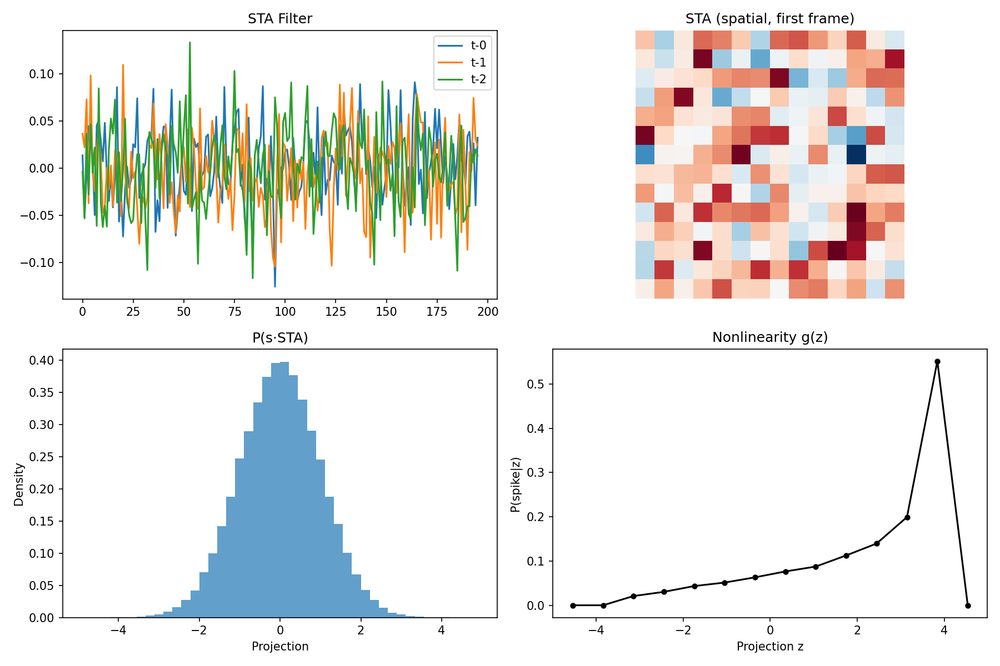
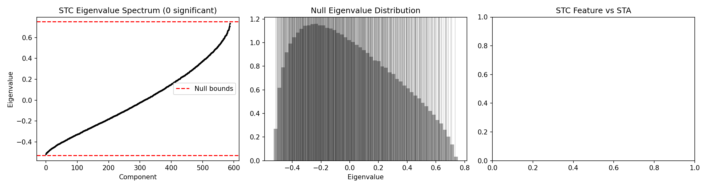
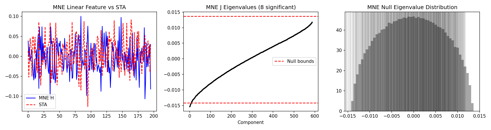
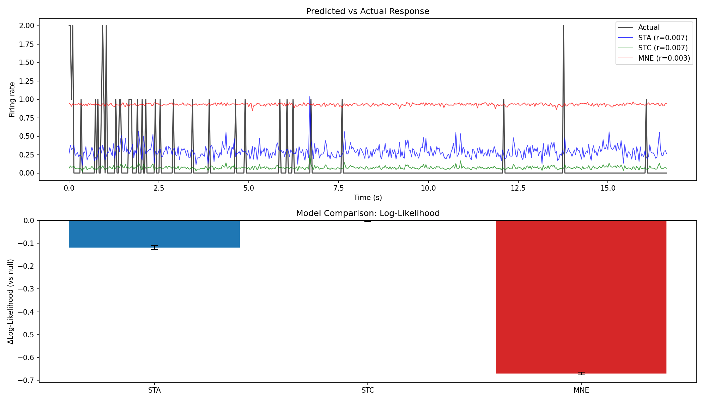

# Spike Train Primer — Python Reproduction Environment

## Introduction

This directory is the Python reproduction development environment for the original MATLAB project (Analysis of Neuronal Spike Trains, Deconstructed).

## Quick Start

### 1. Create Virtual Environment

```bash
cd python
python -m venv .venv
source .venv/bin/activate  # macOS/Linux
```

### 2. Install Dependencies

```bash
# Option 1: Using pip + requirements.txt
pip install -r requirements.txt

# Option 2: Using pip + pyproject.toml (editable install)
pip install -e ".[dev]"
```

### 3. Launch Jupyter Lab

```bash
jupyter lab
```

## Directory Structure

```
python/
├── pyproject.toml          # Project configuration and dependency definitions
├── requirements.txt        # pip dependency list
├── README.md               # This file
├── src/
│   └── primer/
│       ├── __init__.py     # Package entry point
│       ├── io.py           # Data I/O (reading .raw, .isk, .mat files)
│       ├── preprocessing.py # Data preprocessing (stimulus construction, normalization, alignment)
│       ├── sta.py          # STA Spike-Triggered Average
│       ├── stc.py          # STC Spike-Triggered Covariance
│       ├── mne_model.py    # MNE Maximum Noise Entropy model
│       ├── glm.py          # GLM Generalized Linear Model
│       ├── prediction.py   # Model prediction
│       ├── validation.py   # Model validation and evaluation
│       └── plotting.py     # Visualization tools
└── notebooks/
    ├── 01_build_stimulus.ipynb
    ├── 02_sta.ipynb
    ├── 03_stc.ipynb
    ├── 04_mne.ipynb
    ├── 05_glm.ipynb
    └── 06_prediction_validation.ipynb
```

## Library Dependencies

| Library | Purpose | Corresponding MATLAB Functionality |
|---------|---------|-----------------------------------|
| `numpy` | Matrix operations, linear algebra | MATLAB basic operations |
| `scipy` | Signal processing, optimization, `loadmat` for reading .mat | MATLAB built-in functions |
| `h5py` | Reading v7.3 .mat files | MATLAB load |
| `matplotlib` | Plotting | MATLAB plot/figure |
| `scikit-learn` | PCA, cross-validation | MATLAB manual implementations |
| `statsmodels` | GLM fitting | Pillow GLM toolkit |
| `pyglmnet` | Regularized GLM | L1Group optimization |
| `elephant` | STA, spike analysis | Manual STA/STC |
| `spectrum` | Spectral/coherence analysis | Chronux toolkit |
| `cvxpy` | Convex optimization (L1) | Mark Schmidt L1 |

## Optional GPU Acceleration

```bash
pip install -e ".[gpu]"
```

Installs PyTorch and JAX for large-scale model fitting acceleration.







   


